<div align="center">

# ✨ glint

### Give your AI agent a face.

**glint** renders expressive pixel-art emotions on [Tidbyt](https://tidbyt.com) displays — so you can *see* how your agent is feeling at a glance.

<br>


<br>
<br>

No frameworks. No magic. Just pixels and personality.

[Get Started](#installation) · [Emotions](#emotions) · [Styles](#styles) · [Agent Integration](#for-ai-agents)

</div>

---

## Why glint?

AI agents are invisible by default. They run in terminals, in the cloud, in the background — and you have no idea what they're doing or how they're "feeling."

**glint changes that.** It gives agents a physical presence: a pair of expressive eyes on a tiny LED display. Happy when a task succeeds. Worried when something's uncertain. Focused when deep in work.

It's simple, it's delightful, and it makes your agent feel *real*.

---

## Installation

```bash
git clone https://github.com/sethgho/glint.git
cd glint
bun install
```

## Setup

1. Grab your Tidbyt credentials from the mobile app: **Settings → General → Get API Key**

2. Option A — environment variables:
```bash
export TIDBYT_TOKEN=your_token
export TIDBYT_DEVICE_ID=your_device_id
```

   Option B — config file (recommended):
```bash
mkdir -p ~/.config/glint
cat > ~/.config/glint/config.json <<EOF
{
  "token": "your_token",
  "deviceId": "your_device_id",
  "style": "ai-v1",
  "installationId": "glint"
}
EOF
```

CLI flags override config, which overrides env vars.

## Usage

```bash
# Show an emotion
bun run src/cli.ts show excited

# Preview locally (saves a GIF)
bun run src/cli.ts show happy --preview /tmp/happy.gif

# Switch styles
bun run src/cli.ts show happy --style pixel-art

# List everything
bun run src/cli.ts list
bun run src/cli.ts styles
```

### CLI Reference

```
glint show <emotion> [options]
  -s, --style <style>         Visual style (default: from config or ai-v1)
  -t, --token <token>         Tidbyt API token
  -d, --device-id <id>        Tidbyt device ID
  -i, --installation-id <id>  Installation ID (default: "glint")
  -p, --preview <path>        Save GIF preview instead of pushing

glint list                    List available emotions
glint styles                  List available visual styles
```

### Configuration

glint reads defaults from `~/.config/glint/config.json`:

| Key | Type | Description |
|-----|------|-------------|
| `token` | string | Tidbyt API token |
| `deviceId` | string | Tidbyt device ID |
| `style` | string | Default visual style |
| `installationId` | string | Installation ID for Tidbyt |

Priority: **CLI flags → config file → environment variables → built-in defaults**

---

## Emotions

Ten distinct states, each designed to be instantly readable on a 64×32 LED matrix:

| Emotion | When to use it |
|---------|---------------|
| `neutral` | Idle, default state |
| `happy` | Task completed, good news |
| `sad` | Something went wrong |
| `angry` | Critical failure, frustration |
| `surprised` | Unexpected discovery |
| `worried` | Uncertainty, potential problems |
| `sleepy` | Low activity, winding down |
| `excited` | Breakthroughs, anticipation |
| `confused` | Unclear requirements |
| `focused` | Deep work, concentration |

---

## Styles

### `ai-v1` — AI-Generated Cartoon Eyes *(default)*

Soft, expressive cartoon eyes generated with Flux. The most readable style at Tidbyt's native resolution.

| | | | | |
|:---:|:---:|:---:|:---:|:---:|
| <br>neutral | <br>happy | <br>sad | <br>angry | <br>surprised |
| <br>worried | <br>sleepy | <br>excited | <br>confused | <br>focused |

### `anime` — Anime-Style Eyes

Vibrant, sparkle-filled eyes inspired by anime aesthetics.

| | | | | |
|:---:|:---:|:---:|:---:|:---:|
| 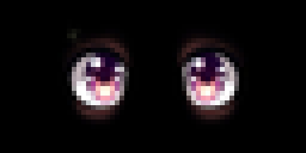<br>neutral | 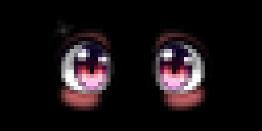<br>happy | 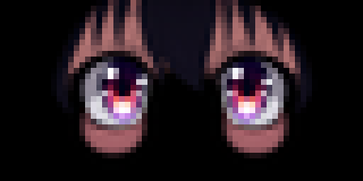<br>sad | 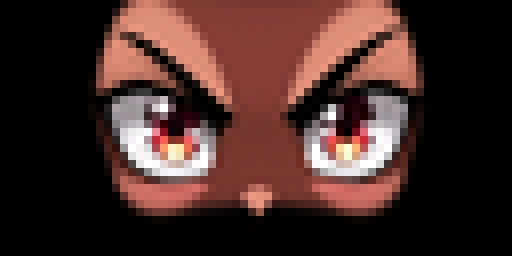<br>angry | 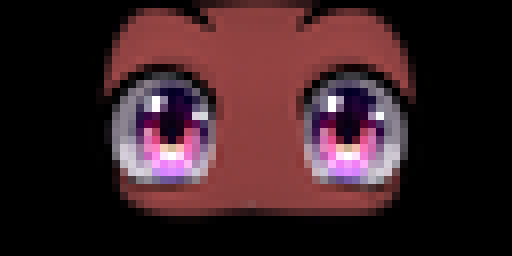<br>surprised |
| 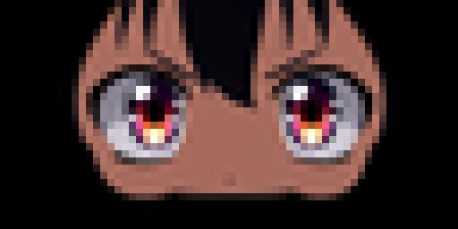<br>worried | 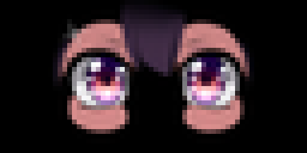<br>sleepy | 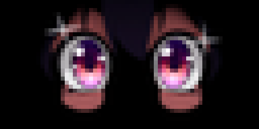<br>excited | 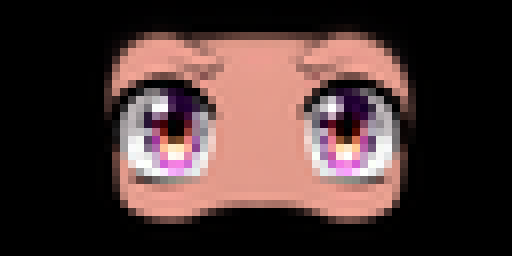<br>confused | 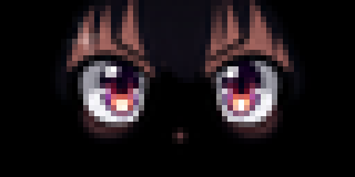<br>focused |

### `pixel-art` — Retro Pixel Art

Chunky, bold pixel art with a retro game aesthetic.

| | | | | |
|:---:|:---:|:---:|:---:|:---:|
| 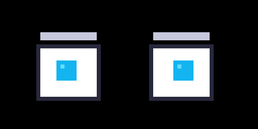<br>neutral | 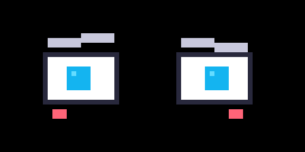<br>happy | 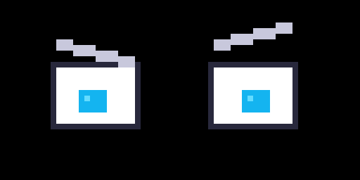<br>sad | 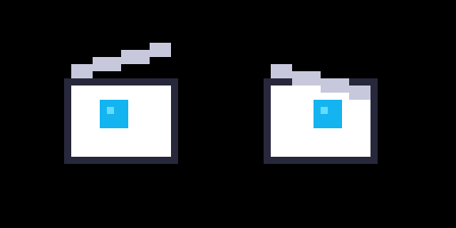<br>angry | 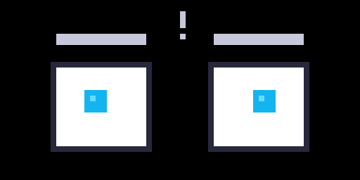<br>surprised |
| 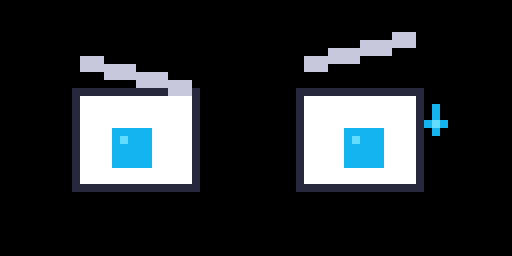<br>worried | 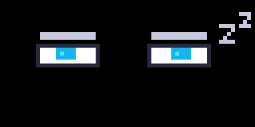<br>sleepy | <br>excited | 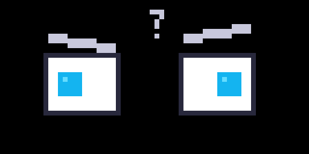<br>confused | 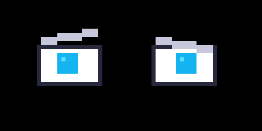<br>focused |

### `default` — Programmatic

Simple geometric eyes and eyebrows drawn entirely in code. No external assets needed.

| | | | | |
|:---:|:---:|:---:|:---:|:---:|
| <br>neutral | <br>happy | <br>sad | 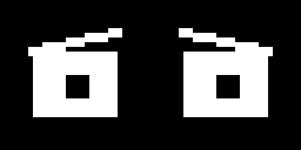<br>angry | 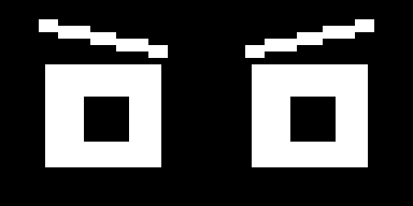<br>surprised |
| <br>worried | <br>sleepy | <br>excited | <br>confused | <br>focused |

---

## For AI Agents

glint is built for AI agents to express their emotional/cognitive state on a physical display. It gives humans ambient visibility into what the agent is doing.

### Quick Integration

1. **Install** glint in your agent's workspace
2. **Configure** `~/.config/glint/config.json` with your Tidbyt credentials
3. **Call** `glint show <emotion>` whenever the agent's state changes

### When to Update

| Situation | Emotion |
|-----------|---------|
| Starting a task | `focused` or `neutral` |
| Task completed | `happy` or `excited` |
| Error encountered | `worried` or `confused` |
| Critical failure | `angry` |
| Unexpected discovery | `surprised` |
| Idle / waiting | `neutral` or `sleepy` |

### Full Agent Docs

See **[SKILL.md](SKILL.md)** for complete integration instructions including skill triggers, state transitions, and credential management.

---

## Architecture

```
emotions.ts  →  draw.ts  →  canvas.ts  →  GIF encoder  →  Tidbyt API
   (config)    (render)    (pixel buf)     (encode)         (push)

styles.ts    →  assets/  →  sharp     →  GIF encoder  →  Tidbyt API
  (registry)   (images)   (composite)    (encode)         (push)
```

- **canvas.ts** — 64×32 RGBA buffer with pixel drawing primitives
- **draw.ts** — Converts emotion config to pixel art (programmatic style)
- **emotions.ts** — Defines the 10 emotions with eye/brow parameters
- **styles.ts** — Manages visual styles (programmatic vs image-based)
- **config.ts** — Reads `~/.config/glint/config.json` for defaults
- **pixelfont.ts** — Crisp 3×5 pixel font for LED displays
- **push.ts** — GIF encoding and Tidbyt API integration

## License

MIT
