<div align="center">


# glint

### Expressive eyes for your display.

Give your AI agent a face. **glint** renders emotion styles on [Tidbyt](https://tidbyt.com), [TRMNL](https://usetrmnl.com), desktop widgets, and any display — so you can *see* how your agent is feeling at a glance.

<br>


<br>

All styles are **SVG** — they scale infinitely to any resolution.

[Get Started](#installation) · [Emotions](#emotions) · [Styles](#styles) · [Community Gallery](https://glint.sethgholson.com) · [Agent Integration](#for-ai-agents)

</div>

---

## Why glint?

AI agents are invisible by default. They run in terminals, in the cloud, in the background — and you have no idea what they're doing or how they're "feeling."

**glint changes that.** It gives agents a physical presence: a pair of expressive eyes on a display. Happy when a task succeeds. Worried when something's uncertain. Focused when deep in work.

It's simple, it's delightful, and it makes your agent feel *real*.

---

## Installation

```bash
git clone https://github.com/sethgho/glint.git
cd glint
bun install
```

## Setup

1. Grab your Tidbyt credentials from the mobile app: **Settings → General → Get API Key**

2. Option A — environment variables:
```bash
export TIDBYT_TOKEN=your_token
export TIDBYT_DEVICE_ID=your_device_id
```

   Option B — config file (recommended):
```bash
mkdir -p ~/.config/glint
cat > ~/.config/glint/config.json <<EOF
{
  "token": "your_token",
  "deviceId": "your_device_id",
  "style": "kawaii",
  "installationId": "glint"
}
EOF
```

CLI flags override config, which overrides env vars.

## Usage

```bash
# Show an emotion
bun run src/cli.ts show excited

# Preview locally (saves a GIF)
bun run src/cli.ts show happy --preview /tmp/happy.gif

# Switch styles
bun run src/cli.ts show happy --style cyberpunk

# List everything
bun run src/cli.ts list
bun run src/cli.ts styles
```

### CLI Reference

```
glint show <emotion> [options]
  -s, --style <style>         Visual style (default: from config or kawaii)
  -t, --token <token>         Tidbyt API token
  -d, --device-id <id>        Tidbyt device ID
  -i, --installation-id <id>  Installation ID (default: "glint")
  -p, --preview <path>        Save GIF preview instead of pushing

glint list                    List available emotions
glint styles                  List available visual styles
glint validate <style>        Validate a style's SVG files
glint generate <style-name>   Generate SVG emotions using AI (LLM)
  --description <desc>        Style description for the AI
  --aesthetic <aesthetic>      Aesthetic direction (e.g. "neon cyberpunk")
  --provider <provider>       LLM backend: claude, codex, opencode, api
  --overwrite                 Overwrite existing style directory
```

### Community Registry

```
glint auth login              Authenticate via GitHub
glint auth whoami             Show current user
glint style search [query]    Search community styles
glint style info @user/style  Show style details
glint style install @user/s   Install a community style
glint style publish <name>    Publish your style
glint style init <name>       Scaffold a new style package
```

### Configuration

glint reads defaults from `~/.config/glint/config.json`:

| Key | Type | Description |
|-----|------|-------------|
| `token` | string | Tidbyt API token |
| `deviceId` | string | Tidbyt device ID |
| `style` | string | Default visual style |
| `installationId` | string | Installation ID for Tidbyt |
| `generate.provider` | string | Default LLM provider (`claude`, `codex`, `opencode`, `api`) |
| `generate.description` | string | Default style description for AI generation |
| `generate.aesthetic` | string | Default aesthetic direction for AI generation |

Priority: **CLI flags → config file → environment variables → built-in defaults**

---

## Emotions

Ten distinct states, each designed to be instantly readable at any size:

| Emotion | When to use it |
|---------|---------------|
| `neutral` | Idle, default state |
| `happy` | Task completed, good news |
| `sad` | Something went wrong |
| `angry` | Critical failure, frustration |
| `surprised` | Unexpected discovery |
| `worried` | Uncertainty, potential problems |
| `sleepy` | Low activity, winding down |
| `excited` | Breakthroughs, anticipation |
| `confused` | Unclear requirements |
| `focused` | Deep work, concentration |

---

## Styles

All glint styles are **SVG-based** — they scale infinitely from Tidbyt (64×32) to TRMNL (800×480) to desktop widgets and beyond. The same file works everywhere.

### `kawaii` — Kawaii Eyes ✨

Big sparkly anime-inspired eyes with vibrant blue irises, blush marks, sparkles, and tears. The default style.

| | | | | |
|:---:|:---:|:---:|:---:|:---:|
| <br>neutral | <br>happy | <br>sad | <br>angry | <br>surprised |
| <br>worried | <br>sleepy | <br>excited | <br>confused | <br>focused |

### `cyberpunk` — Neon Glow

Glowing neon eyes with cyan and magenta, gaussian blur glow effects, and a dark tech aesthetic.

| | | | | |
|:---:|:---:|:---:|:---:|:---:|
| 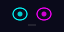<br>neutral | 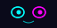<br>happy | 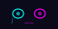<br>sad | 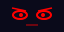<br>angry | 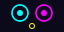<br>surprised |
| 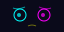<br>worried | <br>sleepy | 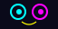<br>excited | 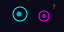<br>confused | 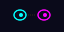<br>focused |

### `retro` — Green Phosphor Terminal

Blocky 8-bit pixel art in green phosphor monochrome. CRT terminal vibes.

| | | | | |
|:---:|:---:|:---:|:---:|:---:|
| 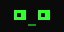<br>neutral | 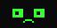<br>happy | 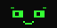<br>sad | 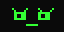<br>angry | 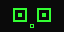<br>surprised |
| 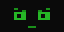<br>worried | 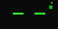<br>sleepy | 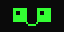<br>excited | 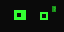<br>confused | 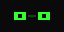<br>focused |

### `spooky` — Halloween Eyes

Jack-o-lantern triangle eyes with eerie orange and green glow. Perfect for October.

| | | | | |
|:---:|:---:|:---:|:---:|:---:|
| <br>neutral | <br>happy | 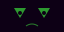<br>sad | <br>angry | <br>surprised |
| 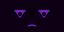<br>worried | 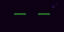<br>sleepy | <br>excited | 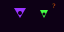<br>confused | <br>focused |

### `minimal` — Clean & Simple

White-on-dark geometric eyes. No frills, maximum readability.

| | | | | |
|:---:|:---:|:---:|:---:|:---:|
| <br>neutral | <br>happy | <br>sad | <br>angry | <br>surprised |
| <br>worried | <br>sleepy | <br>excited | <br>confused | <br>focused |

### 🌐 Community Gallery

Browse and install styles from the community at **[glint.sethgholson.com](https://glint.sethgholson.com)**.

```bash
# Search community styles
glint style search

# Install from the gallery
glint style install @sethgho/cyberpunk

# Publish your own
glint auth login
glint style publish my-style
```

### Creating Your Own Style

Create SVG-based emotion packs in `~/.config/glint/styles/<style-name>/`. Each style needs:

- **10 SVG files** — one per emotion: `neutral.svg`, `happy.svg`, `sad.svg`, `angry.svg`, `surprised.svg`, `worried.svg`, `sleepy.svg`, `excited.svg`, `confused.svg`, `focused.svg`
- **`glint-style.json`** manifest with name, version, and description

**SVG Requirements:**
- Must include `viewBox` attribute (e.g., `viewBox="0 0 64 32"`)
- Max file size: 100KB per emotion (typical SVGs are 1-2KB)
- 2:1 aspect ratio recommended

```bash
# Scaffold a new style
glint style init my-style

# Generate using AI
glint generate my-style --aesthetic "watercolor soft pastels"

# Choose your LLM provider (auto-detected if omitted)
glint generate my-style --aesthetic "pixel art" --provider claude    # Claude Code CLI
glint generate my-style --aesthetic "pixel art" --provider codex     # OpenAI Codex CLI
glint generate my-style --aesthetic "pixel art" --provider opencode  # OpenCode CLI
glint generate my-style --aesthetic "pixel art" --provider api       # Direct Anthropic API (needs ANTHROPIC_API_KEY)

# Or use a preset (no --aesthetic needed)
glint generate cyberpunk   # neon glow
glint generate retro       # green phosphor
glint generate spooky      # halloween
glint generate nature      # earthy tones
glint generate robot       # mechanical LED

# Overwrite an existing style
glint generate my-style --aesthetic "new look" --overwrite

# Validate
glint validate my-style

# Publish to the community
glint auth login
glint style publish my-style
```

#### Style Manifest (`glint-style.json`)

```json
{
  "specVersion": "1.0",
  "name": "my-style",
  "version": "1.0.0",
  "description": "A brief description of your style",
  "emotions": ["happy", "sad", "angry", "surprised", "worried", "sleepy", "excited", "confused", "focused", "neutral"],
  "files": {},
  "tags": ["cute", "colorful"],
  "license": "MIT"
}
```

---

## For AI Agents

glint is built for AI agents to express their emotional/cognitive state on a physical display. It gives humans ambient visibility into what the agent is doing.

### Quick Integration

1. **Install** glint in your agent's workspace
2. **Configure** `~/.config/glint/config.json` with your Tidbyt credentials
3. **Call** `glint show <emotion>` whenever the agent's state changes

### When to Update

| Situation | Emotion |
|-----------|---------|
| Starting a task | `focused` or `neutral` |
| Task completed | `happy` or `excited` |
| Error encountered | `worried` or `confused` |
| Critical failure | `angry` |
| Unexpected discovery | `surprised` |
| Idle / waiting | `neutral` or `sleepy` |

### Full Agent Docs

See **[SKILL.md](SKILL.md)** for complete integration instructions including skill triggers, state transitions, and credential management.

---

## Architecture

```
CLI:    cli.ts → show/validate/generate/publish

Show:   styles.ts → load SVG → resvg (rasterize) → GIF encoder → Tidbyt API
                                  ↓
                          sharp (resize 64×32)

Generate: generate-svg.ts → Anthropic API → SVG files → validate → save

Registry: registry.ts → glint.sethgholson.com API → publish/install/search
```

- **styles.ts** — Manages visual styles (SVG-based, user + built-in)
- **generate-svg.ts** — LLM-powered SVG emotion generation
- **registry.ts** — Community gallery client (auth, publish, install, search)
- **validate.ts** — SVG validation (viewBox, file size, required emotions)
- **config.ts** — Reads `~/.config/glint/config.json` for defaults
- **push.ts** — GIF encoding and Tidbyt API integration

## License

MIT
